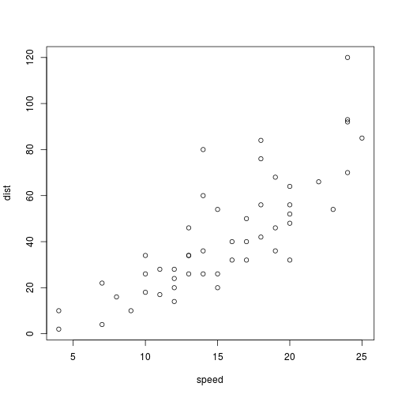
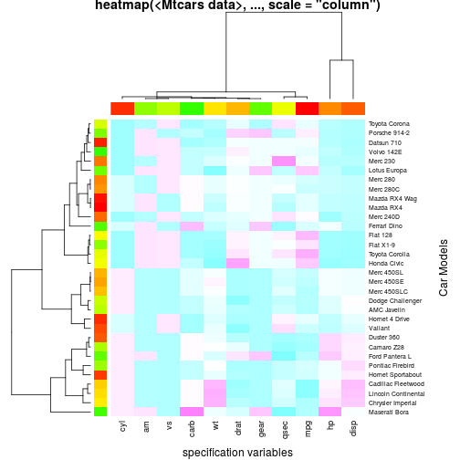

R Fundamentals
========================================================
author: Larry D'Agostino
Dallas R Users Group


11/16/2019


Overview of R
========================================================

- Statistical and Mathematical computing environment
- Developed by academic researchers at the Univ. of Auckland
- Derivative of the proprietary Bell Labs language S
- Mostly object oriented with environments
- Free and open software
- Very active and broad community
  - http://www.meetup.com/Dallas-R-Users-Group/

Getting R and RStudio
========================================================

- R Project home:  http://www.r-project.org
- Download R:  http://cran.revolutionanalytics.com
- My preference for developing in R is using RStudio 
http://www.rstudio.com/

Essential R Skills to Know
========================================================
- Basics of R Console
- Data Manipulation
- Data Visualization
- Extending beyond base R


=======================================================

# **R Skill #1**
# **Basics of R Console**

R Console and Workspace
========================================================

- Interpretive command line

```r
1 + 3*2
```

```
[1] 7
```

- Data objects stored in a *workspace*
  - ls(), class(*object*)
- Workspace defined by environment


Functions
========================================================

- Perform necessary tasks for data processing
- Several are built-in.  Here are two examples

```r
mean(c(3,2,1,5,4,4,1))
```

```
[1] 2.857143
```

- use help() for documentation

```r
help(mean)
```
- getwd(), setwd(), dir()

Data Structures
========================================================

- Vectors

```r
c(1,5,3,7,4,8)
```

```
[1] 1 5 3 7 4 8
```

- Matrices

```r
matrix(c(2,1,3,4,7,1,5,4,2), ncol=3)
```

```
     [,1] [,2] [,3]
[1,]    2    4    5
[2,]    1    7    4
[3,]    3    1    2
```


Data Structures
========================================================

- Lists:  note how *mylist* was assigned as an object using <-

```r
mylist <- list(x = c(4,4,3,3,3), y=c(1,1,5,5,5,3,3,4))
mylist
```

```
$x
[1] 4 4 3 3 3

$y
[1] 1 1 5 5 5 3 3 4
```

```r
length(mylist)
```

```
[1] 2
```


Data Structures
========================================================

- Tables

```r
table(c('a','b','a','a','b','b','c','c','d'))
```

```

a b c d 
3 3 2 1 
```


Data Types
========================================================

- Numeric and Integer
- Character
- Factor
- Date and Time
- Logical (Boolean)


Data Frames
========================================================

Basic data structure for containing different data types of same length.

```r
head(InsectSprays,4)
```

```
  count spray
1    10     A
2     7     A
3    20     A
4    14     A
```

```r
head(InsectSprays$spray)
```

```
[1] A A A A A A
Levels: A B C D E F
```

======================================================
# **R Skill #2**
# **Data Manipulation**

Exploring Data
========================================================


```r
summary(cars)
```

```
     speed           dist       
 Min.   : 4.0   Min.   :  2.00  
 1st Qu.:12.0   1st Qu.: 26.00  
 Median :15.0   Median : 36.00  
 Mean   :15.4   Mean   : 42.98  
 3rd Qu.:19.0   3rd Qu.: 56.00  
 Max.   :25.0   Max.   :120.00  
```

subsetting data with *bracket* indexing

```r
cars[1:2,1:2]
```

```
  speed dist
1     4    2
2     4   10
```

Indexing 
=======================================================
image source: Hadley Wickham


Merging Data
========================================================
combine rows

```r
rbind(cars[1,], cars[5:6,])
```

```
  speed dist
1     4    2
5     8   16
6     9   10
```

combine columns

```r
cbind(cars[1:2,], temp=cars[4:5,1])
```

```
  speed dist temp
1     4    2    7
2     4   10    8
```


{*}pply functions
========================================================

Used to perform fuctions or repeat actions over vectors, matrices and data frames.  Reference by **help(apply)**

- apply() - over rows or columns
- lapply() - over a list
- sapply() - simplified over a vector or list
- tapply() - over a list and reduce similar to mapreduce


{*}pply Examples
========================================================

```r
lapply(mylist, mean)
```

```
$x
[1] 3.4

$y
[1] 3.375
```

```r
tapply(iris$Sepal.Length, iris$Species, mean)
```

```
    setosa versicolor  virginica 
     5.006      5.936      6.588 
```

Import and Export
========================================================

- read.table() and write.table()
- read.delim() and write.delim()
- read.csv() and write.csv()
- Other ways to import and export data through R extensions
  - RODBC
  - RMySQL
  - RPostgreSQL

CSV Export, Import
========================================================

```r
test1 <- c(1:5, "6,7", "8,9,10")
tf <- tempfile()
writeLines(test1, tf)
read.csv(tf, fill = TRUE)
```

```
  X1
1  2
2  3
3  4
4  5
5  6
6  7
7  8
8  9
9 10
```

=======================================================

# **R Skill #3**
# **Data Visualization**

Plots
========================================================
- Simple scatter plot

```r
plot(cars)
```



Line Plot
========================================================

```r
plot(cars, type="l")
```


Histogram
========================================================

```r
hist(rnorm(100))
```


Box Plot
========================================================

```r
boxplot(count ~ spray, data=InsectSprays, col="lightgray")
```


Multiple Charts
========================================================

```r
par(mfrow=c(1,2))
hist(InsectSprays$count)
boxplot(count ~ spray, data=InsectSprays, col="lightgray")
```


Heat Maps
========================================================
- heatmap()


3D Wireframe
========================================================
- wireframe() from "lattice" package


Visualization Beyond base R
========================================================
- lattice
- ggplot  http://ggplot2.org
- GGobi  http://www.ggobi.org
- Shiny  https://www.rstudio.com/products/shiny


=======================================================

# **Skill #4**
# **Extending R**

Extending R
========================================================

The real power of R is the package extensions developed by the R community. Currently 8000+ packages available

- Packages available on CRAN, Github, or download
- CRAN is main repository for R packages
- common R commands to install and load a package

```r
install.packages()
# or install.packages(my-specified-package)
# pick a CRAN repository when prompted

library(my-specified-package)
```


Example #1:  Develop a Regression Line
========================================================
- Use of the function *lm()* and *predict()*

```r
myLine <- lm(dist ~ speed, data=cars)
myLine
```

```

Call:
lm(formula = dist ~ speed, data = cars)

Coefficients:
(Intercept)        speed  
    -17.579        3.932  
```

Develop a Regression Line
========================================================

```r
predLine <- predict(myLine, data.frame(speed=0:25))
plot(cars)
lines(predLine, col="red", lty=2)
```


Example #2:  Develop a Decision Tree
========================================================

```r
library(rpart) # note that rpart comes with base R already installed
myDT <- rpart(dist ~ ., data=cars)
myDT
```

```
n= 50 

node), split, n, deviance, yval
      * denotes terminal node

1) root 50 32538.980 42.98000  
  2) speed< 17.5 31  8306.774 29.32258  
    4) speed< 12.5 15  1176.400 18.20000 *
    5) speed>=12.5 16  3535.000 39.75000 *
  3) speed>=17.5 19  9015.684 65.26316 *
```

Develop a Decision Tree
========================================================

```r
plot(myDT, compress=TRUE)
text(myDT, use.n=TRUE)
```


Develop a Decision Tree
========================================================

```r
predDT <- predict(myDT, cars)
data.frame(avgPred=tapply(cars$dist, predDT, mean),
           numPred=tapply(cars$dist, predDT, length))
```

```
                  avgPred numPred
18.2             18.20000      15
39.75            39.75000      16
65.2631578947368 65.26316      19
```


Getting R Support
========================================================

Busting the myth of customer support hotline

- Dallas R Users Group Helpful Links
http://www.meetup.com/Dallas-R-Users-Group/pages/R_Helpful_Links/
- R Mailing List *or* IRC Freenode Chat (/join #R)
- stats.stackexchange.com *or* stackoverflow.com (tag: R)
- searchable R stuff:  http://www.Rseek.org
- http://www.rdocumentation.org/

Recommended R Books
========================================================

- The Art of R Programming by Norman Matloff http://www.nostarch.com/artofr.htm
- Advanced R Programming by Hadley Wickham http://adv-r.had.co.nz/
- Elements of Statistical Learning by Hastie et al http://statweb.stanford.edu/~tibs/ElemStatLearn/
- Introduction to Statistical Learning http://faculty.marshall.usc.edu/gareth-james/ISL/index.html


==========================================================

# **FAQ** 

How does R work with big data?
===========================================================

- R is limited by available RAM memory
- Yet there are methods to extend the memory and computing power
  - Packages: ff, bigmemory, parallel
  - CRAN Task View: High Performance Computing
- other systems
  - h2o.ai with h2o package
  - spark with sparkr package
- cloud computing
  - AWS, Google Cloud, Azure
  
What is better, Python or R?
===========================================================
- No simple answer
- Use the tool that best fits the job
- Python admittedly better to use data analysis with apps
- R is a better for protyping methods and research

How do I get started learning R?
============================================================
- Find other users *You did it! Check this off*
- Play with the syntax
  - Don't be afraid to get errors  
  - Follow along with online syntax tutor
- Use online classes.  Plenty to choose.
- Follow along with the R community
  - r-bloggers.com
  - twitter: #rstats
- Single biggest way is to use it everyday
  - For work or hobby
  - Get involved with a project
    - TidyTuesday, Kaggle
    - Contribute to a package, app or R code
